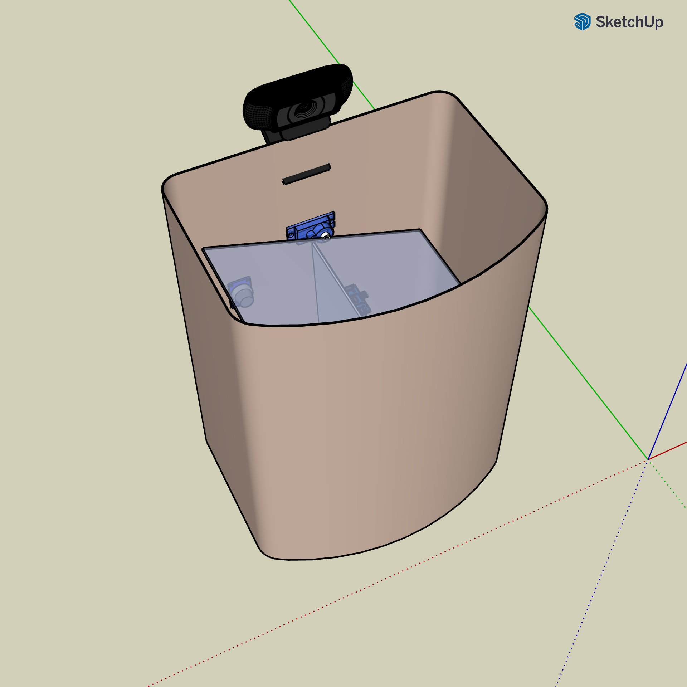
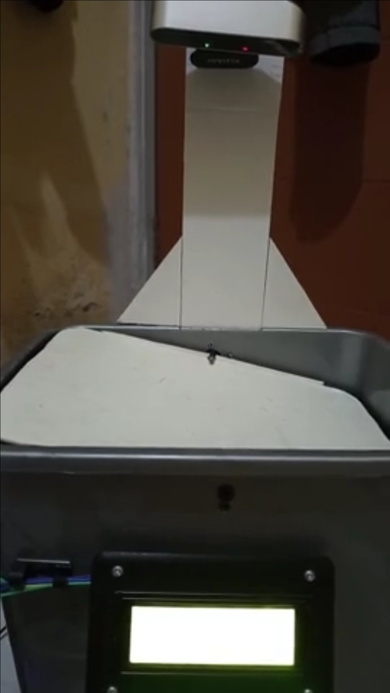
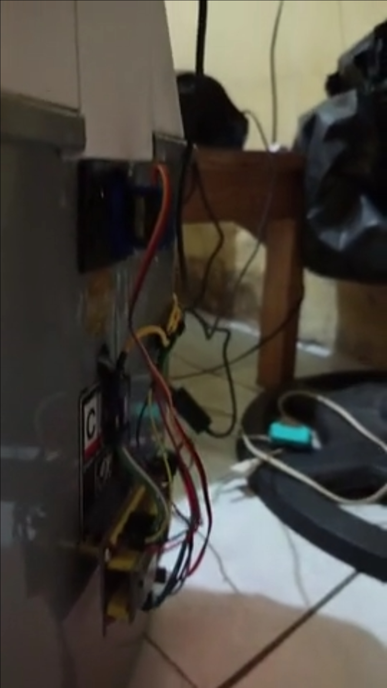
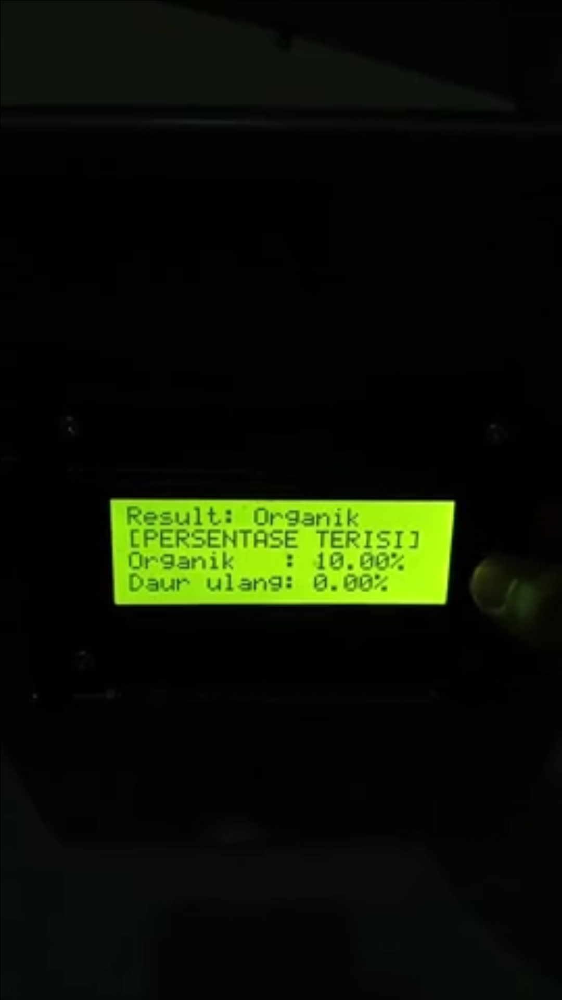

# 🤖 EcoSort Embedded: IoT Hardware Controller


The firmware powering the physical **EcoSort** waste bin. Running on an **ESP32**, this system manages the sorting mechanics (Servos), monitors bin capacity (Ultrasonics), and provides a user-friendly configuration interface via a captive WiFi portal.

## 🔗 Related Repository
* **AI & Computer Vision:** [**EcoSort**](https://github.com/rediahmds/eco-sort)
    * Contains the Python application, ResNet50 model, and Streamlit dashboard.

## 📐 3D Enclosure Design
The mechanical structure was designed using **SketchUp** to ensure precise component placement.



## 📸 Prototype Implementation

| Front | Rear | LCD |
| --- | --- | --- |
|  |  |  |

## 📱 Mobile Dashboard (Blynk)
Users can monitor bin levels (Organic vs. Anorganic) and control the sorting flap manually via the Blynk Mobile App.


## ⚡ Firmware Features

* **Automated Sorting:** Receives AI commands ("Organik" / "Daur ulang") to tilt the servo mechanism.
* **Bin Level Monitoring:** Dual **Ultrasonic Sensors (HC-SR04)** measure real-time fullness (%) of Organic and Recyclable compartments.
* **WiFi Manager (NetWizard):** Connects to WiFi without hardcoding credentials. Launches a captive portal (`EcoSort AP`) for easy setup.
* **OTA Updates:** Supports **ElegantOTA** for wireless firmware uploads via `http://<IP>/update`.
* **Status Display:** Drives a **20x4 I2C LCD** to show connection status, sorting results, and bin capacity.

## 🔌 Hardware Pinout

| Component | ESP32 GPIO | Description |
| :--- | :--- | :--- |
| **Servo Motor** | `13` | Controls the sorting flap |
| **Ultrasonic (Organic)** | Trig `26` / Echo `25` | Measures organic bin level |
| **Ultrasonic (Recyclable)** | Trig `33` / Echo `32` | Measures recyclable bin level |
| **LCD Display (I2C)** | SDA `21` / SCL `22` | Displays system info |

## 📊 Blynk Configuration

The firmware communicates via these Virtual Pins:

* **Inputs (Commands):**
    * `V0`: Inference Result (String: "Organik" / "Daur ulang")
    * `V8`: Reset WiFi Credentials
    * `V11`: Manual Open Recyclable
    * `V12`: Manual Open Organic
* **Outputs (Data):**
    * `V2`: Organic Level (%)
    * `V3`: Recyclable Level (%)
    * `V5`: Device IP Address
    * `V7`: System Status ("ready" / "busy")

## 🛠️ Setup & Flashing

### 1. Requirements
* [VS Code](https://code.visualstudio.com/) with **PlatformIO** extension.
* ESP32 Development Board (e.g., ESP32 DOIT DevKit V1).

### 2. Credentials
Rename `src/credentials/credentials.example.h` to `src/credentials/credentials.h` and configure your settings:

```cpp
#define BLYNK_AUTH_TOKEN "Your_Blynk_Token_Here"
#define OTA_USERNAME "admin"
#define OTA_PASSWORD "admin"
```

### 3. Build & Upload
1. Connect ESP32 via USB.
2. Open the project in PlatformIO.
3. Click Build (✓) and then Upload (→).

### 4. WiFi Setup (First Run)
1. If the ESP32 cannot connect to WiFi, it will broadcast a hotspot named EcoSort AP.
2. Connect to this hotspot using your phone or laptop.
3. A portal should open automatically (or visit 192.168.4.1).
4. Enter your local WiFi credentials and save.

## 🧩 Libraries Used
- [`ElegantOTA`](https://github.com/ayushsharma82/ElegantOTA) - Wireless updates.
- [`NetWizard`](https://github.com/ayushsharma82/NetWizard) - WiFi provisioning portal.
- [`Blynk`](https://github.com/blynkkk/blynk-library) - IoT cloud communication.
- [`ESP32Servo`](https://github.com/madhephaestus/ESP32Servo) - Servo motor control.
- [`NewPing`](https://bitbucket.org/teckel12/arduino-new-ping/src/master/) - Reliable ultrasonic sensor reading.
- [`LiquidCrystal_I2C`](https://github.com/blackhack/LCD_I2C) - Display driver.
